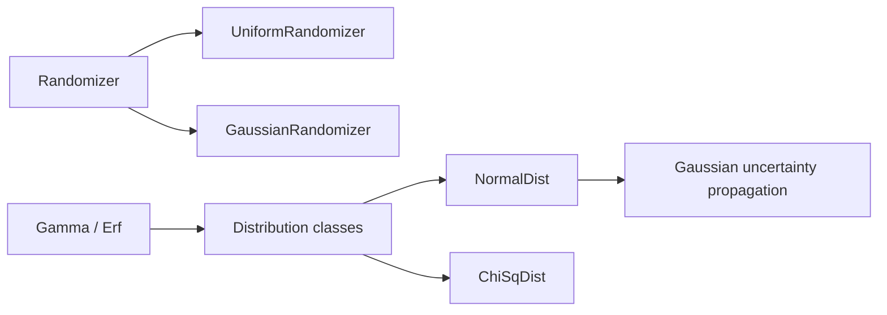

# irurueta-statistics

📊 **Irurueta Statistics** is a lightweight Java library for pseudo-random number generation and for working with common statistical distributions.

It provides randomizers that produce uniformly or Gaussian distributed values, distribution classes that evaluate probability density, cumulative distribution, and inverse cumulative distribution functions, and the low-level special functions (gamma, error function) used to implement them.

[](https://github.com/albertoirurueta/irurueta-statistics/actions)
[](https://github.com/albertoirurueta/irurueta-statistics/actions)

[](https://sonarcloud.io/dashboard?id=albertoirurueta_irurueta-statistics)
[](https://sonarcloud.io/dashboard?id=albertoirurueta_irurueta-statistics)
[](https://sonarcloud.io/dashboard?id=albertoirurueta_irurueta-statistics)

[](https://sonarcloud.io/dashboard?id=albertoirurueta_irurueta-statistics)
[](https://sonarcloud.io/dashboard?id=albertoirurueta_irurueta-statistics)

[](https://sonarcloud.io/dashboard?id=albertoirurueta_irurueta-statistics)
[](https://sonarcloud.io/dashboard?id=albertoirurueta_irurueta-statistics)
[](https://sonarcloud.io/dashboard?id=albertoirurueta_irurueta-statistics)

[](https://sonarcloud.io/dashboard?id=albertoirurueta_irurueta-statistics)
[](https://sonarcloud.io/dashboard?id=albertoirurueta_irurueta-statistics)
[](https://sonarcloud.io/dashboard?id=albertoirurueta_irurueta-statistics)

## ✨ Features

- `UniformRandomizer` and `GaussianRandomizer` for generating pseudo-random booleans, ints, longs, floats, and doubles.
- `NormalDist` and `ChiSqDist` distribution classes exposing p.d.f., c.d.f., and inverse c.d.f. (both as static and instance methods).
- Non-linear propagation of Gaussian uncertainty through arbitrary differentiable functions.
- `Gamma` and `Erf` special functions (factorials, beta function, incomplete gamma, error function and its inverse) used internally and available for direct use.
- Implementation based on the algorithms in _Numerical Recipes, 3rd Edition_.
- No runtime third-party dependencies.



## 🚦 Project status

- Current development version: `1.5.0-SNAPSHOT`
- Java target: Java 17
- Build system: Maven
- License: Apache License 2.0
- Quality checks: GitHub Actions, JaCoCo, Surefire, and SonarCloud

## 📚 Documentation

- [Project documentation](https://albertoirurueta.github.io/irurueta-statistics/)
- [Javadoc report](https://albertoirurueta.github.io/irurueta-statistics/mvn-site/apidocs/index.html)
- [JaCoCo coverage report](https://albertoirurueta.github.io/irurueta-statistics/mvn-site/jacoco/index.html)
- [Surefire test report](https://albertoirurueta.github.io/irurueta-statistics/mvn-site/surefire-report.html)
- [Maven site report](http://albertoirurueta.github.io/irurueta-statistics/mvn-site)
- [SonarCloud dashboard](https://sonarcloud.io/dashboard?id=albertoirurueta_irurueta-statistics)

The Antora documentation source lives in [`docs/modules/ROOT`](docs/modules/ROOT).

## 📦 Installation

### Maven

For a released dependency, pin the version you want to use. Example:

```xml
<dependency>
    <groupId>com.irurueta</groupId>
    <artifactId>irurueta-statistics</artifactId>
    <version>1.4.0</version>
</dependency>
```

For local development against the current repository snapshot:

```xml
<dependency>
    <groupId>com.irurueta</groupId>
    <artifactId>irurueta-statistics</artifactId>
    <version>1.5.0-SNAPSHOT</version>
</dependency>
```

### Gradle

```kotlin
dependencies {
    implementation("com.irurueta:irurueta-statistics:1.4.0")
}
```

## 🚀 Quick examples

### Generate pseudo-random values

```java
import com.irurueta.statistics.UniformRandomizer;
import com.irurueta.statistics.GaussianRandomizer;

UniformRandomizer uniformRandomizer = new UniformRandomizer();
double uniformValue = uniformRandomizer.nextDouble(0.0, 10.0);

GaussianRandomizer gaussianRandomizer = new GaussianRandomizer(0.0, 1.0);
double gaussianValue = gaussianRandomizer.nextDouble();
```

Classes used: [`UniformRandomizer`](https://albertoirurueta.github.io/irurueta-statistics/mvn-site/apidocs/com/irurueta/statistics/UniformRandomizer.html) ([source](https://github.com/albertoirurueta/irurueta-statistics/blob/master/src/main/java/com/irurueta/statistics/UniformRandomizer.java)), [`GaussianRandomizer`](https://albertoirurueta.github.io/irurueta-statistics/mvn-site/apidocs/com/irurueta/statistics/GaussianRandomizer.html) ([source](https://github.com/albertoirurueta/irurueta-statistics/blob/master/src/main/java/com/irurueta/statistics/GaussianRandomizer.java)).

### Evaluate a normal distribution

```java
import com.irurueta.statistics.NormalDist;

NormalDist dist = new NormalDist(0.0, 1.0);
double density = dist.p(1.5);
double probability = dist.cdf(1.5);
double x = dist.invcdf(0.975);
```

Classes used: [`NormalDist`](https://albertoirurueta.github.io/irurueta-statistics/mvn-site/apidocs/com/irurueta/statistics/NormalDist.html) ([source](https://github.com/albertoirurueta/irurueta-statistics/blob/master/src/main/java/com/irurueta/statistics/NormalDist.java)).

### Evaluate a chi-squared distribution

```java
import com.irurueta.statistics.ChiSqDist;

double degreesOfFreedom = 5.0;
double probability = ChiSqDist.cdf(3.2, degreesOfFreedom);
```

Classes used: [`ChiSqDist`](https://albertoirurueta.github.io/irurueta-statistics/mvn-site/apidocs/com/irurueta/statistics/ChiSqDist.html) ([source](https://github.com/albertoirurueta/irurueta-statistics/blob/master/src/main/java/com/irurueta/statistics/ChiSqDist.java)).

### Propagate Gaussian uncertainty through a function

```java
import com.irurueta.statistics.NormalDist;
import com.irurueta.statistics.NormalDist.DerivativeEvaluator;

NormalDist input = new NormalDist(2.0, 0.1);
DerivativeEvaluator square = new DerivativeEvaluator() {
    @Override
    public double evaluate(double x) {
        return x * x;
    }

    @Override
    public double evaluateDerivative(double x) {
        return 2.0 * x;
    }
};

NormalDist propagated = NormalDist.propagate(square, input);
```

Classes used: [`NormalDist`](https://albertoirurueta.github.io/irurueta-statistics/mvn-site/apidocs/com/irurueta/statistics/NormalDist.html) ([source](https://github.com/albertoirurueta/irurueta-statistics/blob/master/src/main/java/com/irurueta/statistics/NormalDist.java)), [`NormalDist.DerivativeEvaluator`](https://albertoirurueta.github.io/irurueta-statistics/mvn-site/apidocs/com/irurueta/statistics/NormalDist.DerivativeEvaluator.html) ([source](https://github.com/albertoirurueta/irurueta-statistics/blob/master/src/main/java/com/irurueta/statistics/NormalDist.java)).

## 🛠️ Build from source

Clone the repository and run Maven:

```bash
git clone https://github.com/albertoirurueta/irurueta-statistics.git
cd irurueta-statistics
mvn test
```

Useful commands:

```bash
mvn test          # run unit tests
mvn package       # build the JAR and generate JaCoCo coverage
mvn site          # generate Maven site reports
```

To build the Antora documentation locally:

```bash
cd docs
npx antora antora-playbook.yml
```

## 🧮 Supported statistical building blocks

| Class | Purpose | Javadoc | Source |
| --- | --- | --- | --- |
| `UniformRandomizer` | Generates pseudo-random values uniformly distributed. | [javadoc](https://albertoirurueta.github.io/irurueta-statistics/mvn-site/apidocs/com/irurueta/statistics/UniformRandomizer.html) | [source](https://github.com/albertoirurueta/irurueta-statistics/blob/master/src/main/java/com/irurueta/statistics/UniformRandomizer.java) |
| `GaussianRandomizer` | Generates pseudo-random values following a normal distribution. | [javadoc](https://albertoirurueta.github.io/irurueta-statistics/mvn-site/apidocs/com/irurueta/statistics/GaussianRandomizer.html) | [source](https://github.com/albertoirurueta/irurueta-statistics/blob/master/src/main/java/com/irurueta/statistics/GaussianRandomizer.java) |
| `NormalDist` | p.d.f., c.d.f., inverse c.d.f., and Gaussian uncertainty propagation. | [javadoc](https://albertoirurueta.github.io/irurueta-statistics/mvn-site/apidocs/com/irurueta/statistics/NormalDist.html) | [source](https://github.com/albertoirurueta/irurueta-statistics/blob/master/src/main/java/com/irurueta/statistics/NormalDist.java) |
| `ChiSqDist` | p.d.f., c.d.f., and inverse c.d.f. of the chi-squared distribution. | [javadoc](https://albertoirurueta.github.io/irurueta-statistics/mvn-site/apidocs/com/irurueta/statistics/ChiSqDist.html) | [source](https://github.com/albertoirurueta/irurueta-statistics/blob/master/src/main/java/com/irurueta/statistics/ChiSqDist.java) |
| `Gamma` | Gamma function, factorials, beta function, incomplete gamma function. | [javadoc](https://albertoirurueta.github.io/irurueta-statistics/mvn-site/apidocs/com/irurueta/statistics/Gamma.html) | [source](https://github.com/albertoirurueta/irurueta-statistics/blob/master/src/main/java/com/irurueta/statistics/Gamma.java) |
| `Erf` | Error function, complementary error function, and their inverses. | [javadoc](https://albertoirurueta.github.io/irurueta-statistics/mvn-site/apidocs/com/irurueta/statistics/Erf.html) | [source](https://github.com/albertoirurueta/irurueta-statistics/blob/master/src/main/java/com/irurueta/statistics/Erf.java) |

## 🤝 Contributing

Issues and pull requests are welcome.
Before submitting a change, run:

```bash
mvn test
```

For changes affecting documentation, also run:

```bash
cd docs
npx antora antora-playbook.yml
```

## 📄 License

This project is licensed under the [Apache License 2.0](https://www.apache.org/licenses/LICENSE-2.0).
